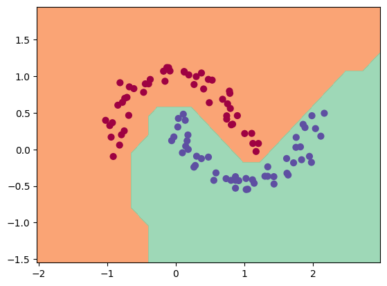

A rebuild of the Micrograd, a tiny Autograd engine by karpathy
(Here is the original git rep)[https://github.com/karpathy/micrograd] . 

Implements backpropagation (reverse-mode autodiff) over a dynamically built DAG and a small neural networks library on top of it with a PyTorch-like API. Both are tiny, with about 100 and 50 lines of code respectively. The DAG only operates over scalar values, so e.g. we chop up each neuron into all of its individual tiny adds and multiplies. However, this is enough to build up entire deep neural nets doing binary classification, as the demo.ipynb notebook shows.
